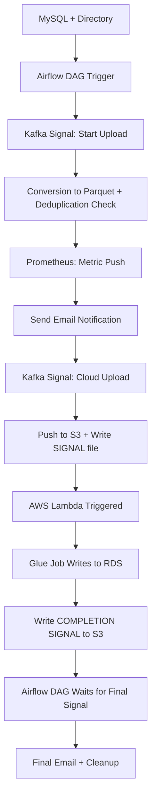

# 📦 NimbusVerse: End-to-End Data Pipeline in Docker

NimbusVerse is a production-grade, Dockerized data pipeline that integrates traditional data sources, cloud services, monitoring tools, and event-driven orchestration. This project transforms raw structured, semi-structured, and unstructured data into a well-monitored and automated ETL flow using Apache Airflow, Kafka, AWS, Prometheus, Grafana, and more.

---

## 🔧 Features

- 🛢️ Extracts data from MySQL and local directories
- 📊 Sends real-time metrics to Prometheus, visualized in Grafana
- 🔄 Converts CSV to Parquet for scalability and optimized storage
- 🧾 Processes structured (CSV, SQL), semi-structured (JSON, XML), and unstructured (PDF, image, audio, video) files
- 📡 Uses Kafka for triggering downstream jobs and sending process signals
- 📬 Sends email notifications at defined checkpoints
- ☁️ Uploads files to AWS S3, executes Glue jobs via Lambda
- 🧠 Maintains deduplication using a persistent CSV report
- 🔄 Fully containerized using Docker with support for recovery wrappers

---

## 🗂️ Folder Structure

```bash
NimbusVerse/
│
├── docker/
│   ├── airflow/        # Main DAGs and orchestration scripts
│   ├── kafka/          # Kafka and Zookeeper Docker setup
│   ├── scripts/        # Prometheus metric emission scripts
│
├── grafana/            # Independent Grafana dashboards
├── mysql/              # Standalone MySQL database
├── aws/                # AWS Lambda, Glue job code, configs
└── README.md           # You're here
```

---

## 📈 Monitoring Dashboard

- Prometheus scrapes metrics from the `scripts/` module.
- Grafana visualizes metrics in real-time.
- Alerts can be extended via email, Slack, or Alertmanager.

---

## 🚀 Pipeline Flow



---

## 🔄 Deduplication Mechanism

A central `report.csv` tracks processed files with their timestamps. Every task checks this CSV to:

- Avoid duplicate processing
- Provide auditability
- Maintain efficiency

---

## 🧪 Recovery Mechanism

- Each major script is wrapped with error recovery blocks
- Prevents task abortion from false alarms or retryable exceptions

---

## 🧱 Built With

- **Apache Airflow** – Orchestration
- **Apache Kafka** – Messaging & signaling
- **AWS (Lambda, Glue, S3, RDS)** – Cloud processing
- **PySpark & Pandas** – Data transformations
- **Prometheus & Grafana** – Monitoring & dashboards
- **Docker** – Containerized deployment

---

## 🌱 Future Enhancements

- Push JSON/XML/PDF metadata to **DynamoDB**
- Extract and load unstructured data metadata into **Amazon Redshift**
- Add **CI/CD pipelines** using GitHub Actions
- Integrate **Alertmanager** for critical failures

---

## 📬 Author

**Arin Dubey**

> Passionate about data engineering, automation, and cloud-native solutions.

---

## 📝 License

MIT License — feel free to use and adapt this project with attribution.

---

## 📌 Note

This project was built entirely within Docker containers, reflecting real-world deployment standards and enterprise-grade pipeline design.

---

For diagrams and a full project synopsis, refer to the `/docs/` folder or request a PDF version.

